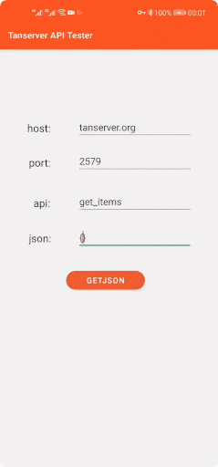

<div align=center>
    
</div>

<div align=center>
    
    
    
</div>

# Tanserver

Tanserver is a lightweight server framework.

It receives JSON string from the client and returns JSON string after querying the database.

Works with most Android / iOS / desktop applications.

## Documentation

* [Install Tanserver](https://www.tanserver.org/#/install)
* [Tanserver documentation](https://www.tanserver.org)
* [中文文档](https://www.tanserver.org/#/zh/)

## Features

- **Security** ：Encrypted based on SSL protocol.

- **Hot reload** ：Help you quickly add APIs or fix bugs.

- **Log shipping** ：Support log shipping.

## Connector

1. [Java](https://github.com/tansrv/tanserver-connector-java)

Currently only support `Java` client, and will soon support: `Swift`, `Dart`, and `C++`.

## Example

API: `get_items`

Convert items table data into JSON string and send it to the client.

`items`
| id   | name     | price |
| ---- | ----     | ----  |
| 0    | book     | 5     |
| 1    | keyboard | 200   |

```cpp
string
get_items(const Json::Value &value_recvd)
{
    try {
        string  json_string = pg_query("8.8.8.8", /* Your PostgreSQL server IP address  */
                                       "select array_to_json(array_agg(row_to_json(items))) from items;",
                                       NULL);

        json_append_status(json_string, 0, "OK");
        return json_string;
    } catch (...) {
        throw "error";
    }
}
```

When the client calls `getJSON("get_items", "{}")`:



---

Copyright (C) tanserver.org
